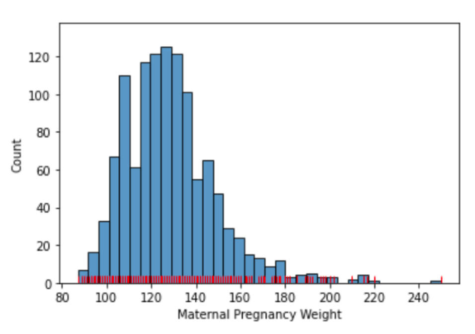

# Data 100 - Principles and Techniques of Data Science

    University of California, Berkeley
    ds100.org

## Table of Contents- [Data 100 - Principles and Techniques of Data Science](#data-100---principles-and-techniques-of-data-science)
  - [Table of Contents](#table-of-contents)
  - [Lecture 1 - Course Overview](#lecture-1---course-overview)
    - [What is Data Science?](#what-is-data-science)
    - [Primary Goal in this course](#primary-goal-in-this-course)
    - [Topics covered:](#topics-covered)
    - [The Data Science Life Cycle:](#the-data-science-life-cycle)
  - [Lecture 2 - Sampling and Probability](#lecture-2---sampling-and-probability)
    - [Censuses and Surveys](#censuses-and-surveys)
    - [Sampling: Definitions](#sampling-definitions)
      - [Population, sample, and sampling frame](#population-sample-and-sampling-frame)
      - [Polling Case #1: The Literary Digest](#polling-case-1-the-literary-digest)
      - [Polling Case #2: Gallup's Poll - Election Prediction](#polling-case-2-gallups-poll---election-prediction)
      - [**Common Biases**](#common-biases)
    - [Quality, not quantity!](#quality-not-quantity)
  - [Samples](#samples)
    - [Common Non-Random Samples](#common-non-random-samples)
    - [Probability Sample (aka Random Sample)](#probability-sample-aka-random-sample)
      - [Example Scheme 1: Probability Sample](#example-scheme-1-probability-sample)
    - [Common random sampling schemes](#common-random-sampling-schemes)
      - [Example Scheme 2: Simple Random Sample?](#example-scheme-2-simple-random-sample)
    - [A very common approximation for sampling](#a-very-common-approximation-for-sampling)
    - [Recap of Probability Sampling:](#recap-of-probability-sampling)
  - [Multinomial and Binomial probabilites](#multinomial-and-binomial-probabilites)
    - [Binomial probability: two categories](#binomial-probability-two-categories)
    - [Multinomial probability: multiple categories](#multinomial-probability-multiple-categories)
      - [Generalization of multinomial probabilities](#generalization-of-multinomial-probabilities)
  - [Lecture 3 - Pandas, Part I](#lecture-3---pandas-part-i)
    - [DataFrames](#dataframes)
      - [The DataFrame API](#the-dataframe-api)
      - [> Very Basic Indexing Example](#-very-basic-indexing-example)
    - [Operators](#operators)
      - [[]](#)
    - [Pandas Data Structures](#pandas-data-structures)
      - [Getting a DataFrame Rather than a Series](#getting-a-dataframe-rather-than-a-series)
      - [Retrieving Row and Column Labels](#retrieving-row-and-column-labels)
    - [Conditional Selection](#conditional-selection)
      - [Boolean Array Input](#boolean-array-input)
      - [Alternatives to Boolean Array Selection](#alternatives-to-boolean-array-selection)
    - [Handy Utility Functions](#handy-utility-functions)
      - [Numpy and Built-in Function Support](#numpy-and-built-in-function-support)
        - [`size/shape`](#sizeshape)
        - [`describe`](#describe)
        - [`sample`](#sample)
        - [`value_counts`](#value_counts)
        - [`unique`](#unique)
      - [`sort_values`](#sort_values)
  - [Lecture 4 - Pandas II](#lecture-4---pandas-ii)
    - [Custom Sort](#custom-sort)
    - [Adding, Modifying, and Removing Columns](#adding-modifying-and-removing-columns)
      - [Sorting by Arbitrary Functions](#sorting-by-arbitrary-functions)
    - [Groupby.agg](#groupbyagg)
      - [Example: Find female baby name whose popular name has fallen the most](#example-find-female-baby-name-whose-popular-name-has-fallen-the-most)
      - [Approach 1: Naive for-loop approach](#approach-1-naive-for-loop-approach)
      - [Approach 2: groupby.agg](#approach-2-groupbyagg)
    - [use groupby.agg() but maintain row ordering](#use-groupbyagg-but-maintain-row-ordering)
    - [Other DataFrameGroupBy object Features](#other-dataframegroupby-object-features)
      - [groupbuy.size()](#groupbuysize)
      - [Filtering by Group](#filtering-by-group)
    - [Pivot Tables](#pivot-tables)
    - [Joining Tables](#joining-tables)
  - [Lecture 5 - Data Wrangling, Exploratory Data Analysis (EDA)](#lecture-5---data-wrangling-exploratory-data-analysis-eda)
    - [Data Wrangling](#data-wrangling)
    - [Key Data Properties](#key-data-properties)
    - [Structure](#structure)
      - [File Format](#file-format)
      - [Variable Types](#variable-types)
      - [Multiple Files](#multiple-files)
    - [Granularity, Scope, Temporality](#granularity-scope-temporality)
      - [Granularity](#granularity)
      - [Scope](#scope)
      - [Temporality](#temporality)
    - [Faithfulness (and missing values)](#faithfulness-and-missing-values)
      - [Addressing Missing Data/Default Values](#addressing-missing-datadefault-values)
  - [Lecture 6 - Regex](#lecture-6---regex)
    - [Why work with text? Two main goals](#why-work-with-text-two-main-goals)
    - [Python String Methods](#python-string-methods)
    - [Regex Basics](#regex-basics)
    - [Convenient Regex](#convenient-regex)
    - [Finding Regex Groups](#finding-regex-groups)
      - [Raw Strings in Python](#raw-strings-in-python)
      - [Extraction](#extraction)
  - [Lecture 7 - Visualization I](#lecture-7---visualization-i)
    - [What is a distribution?](#what-is-a-distribution)
    - [Goals of Data Visualization](#goals-of-data-visualization)
    - [Bar Plots](#bar-plots)
    - [Histograms](#histograms)
      - [Rugplots](#rugplots)
      - [Evaluating Histograms](#evaluating-histograms)
      - [Skewness and Tails](#skewness-and-tails)
      - [Outliers](#outliers)
      - [Modes](#modes)
      - [Histograms + Density](#histograms--density)
      - [Data 8 Review: Computing Density from Counts and Bin Size](#data-8-review-computing-density-from-counts-and-bin-size)
    - [Quartiles](#quartiles)
    - [Box Plots and Violin Plots](#box-plots-and-violin-plots)
    - [Comparing Quantiative Distributions](#comparing-quantiative-distributions)
      - [Overlaid histograms and density curves](#overlaid-histograms-and-density-curves)
      - [Box plot & violin](#box-plot--violin)
    - [Relationships Between Quantitative Variables](#relationships-between-quantitative-variables)
      - [Scatter Plots](#scatter-plots)
    - [Hex plots](#hex-plots)
    - [Countour plots](#countour-plots)


## Lecture 1 - Course Overview

### What is Data Science?
**Data Science** is the application of data centric, computational, and inferential thinking to:

### Primary Goal in this course
Be able to take data and produce useful insights on the world's most challenging and ambiguous problems.

### Topics covered:


### The Data Science Life Cycle:

1. Question/Problem Formulation:
   * What do we want to know?
   * What problems are we trying to solve?
   * What are the hypotheses we want to test?
   * What are our metrics for success? 

2. Data Acquisition and Cleaning
   * What data do we have and what data do we need?
   * How will we sample more data?
   * Is our data representative of the population we want to study?

3. Exploratory Data Analysis & Visualizations
   * How is our data organized and what does it contain?
   * Do we already have relevant data?
   * What are the biases, anomalies, or other issues with the data?
   * How do we transform the data to enable effective analysis?

4. Prediction and Inference
   * What does the data say about the world?
   * Does it answer our questions or accurately solve the problem?
   * How robust are our conclusions and can we trust the predictions?


## Lecture 2 - Sampling and Probability
How do we collect data?

### Censuses and Surveys
The US Decennial Census
* was held in April 2020
* counts **every person** living in all 50 states, DC, and US territories (not just citizens)
* Mandated by the Constitution. Participation required by law.
* Important uses:
  * ...


> A **census** is an "official count or survey of a **population**, typically recording various details of individuals.


A **survey** is a set of questions.
* For instance: workers survey individuals and households

What is asked, and how it is asked, can affect:
* How the respondent answers
* *whether* the respondent answers


### Sampling: Definitions
Sampling from a finite population

> Inference: quantifying degree of certainty in our models of the world. 
> 
A **sample** is a subset of the population.
* Samples are used to make *inferences about the population*
* How you draw the sample will affect your accuracy.
* Two common sources of error:
  * **chance error**: random samples can vary from what is expected, in any direction (taking a random sample, and then another and you get different results)
      > Example: Chance error is when your sample is not representative due to random chance, e.g. I survey 10 berkeley students and they are all female just by random happenstance. Bias is because my sampling frame doesn't represent my population, e.g. I do a survey at a sorority to represent the berkeley population.
  * **bias**: a systematic error in one direction
      > Example: If we poll DS100 students who are at lecture, that's an example of bias, as it includes only people who are comfortable being in lecture during Omicron life.

#### Population, sample, and sampling frame
**Population**: The group that you want to learn something aobut
**Sampling Frame**: The list from which the sample is drawn.
* If you're sampling people, the sampling frame is the set of all people that could possibly end up in your sample.
* In what situation would we have a sampling frame that is different than the population?
   > For example, if we took a poll of the people in lecture right now, the sample frame would be whoever showed up to lecture in person. But that isn't representative of the rest of DS100 who may be watching online, watching the webcast, or will never watch it at all.

**Sample**: Who you actually end up sampling.
* A subset of your sampling frame

There may be individuals in your sampling frame (and hence, your sample) that are not in your population! 


#### Polling Case #1: The Literary Digest
1) The Literary Digest sample was **not representative** of the population.
   * The Digest's **sampling frame:** people in the phonebook, subscribed to magazines, and wnet to country clubs
   * People tended to be richer and vote Republican (Landon).
2) Only 2.4 million people actually filled out the survey!
   * 24% response rate (low)


#### Polling Case #2: Gallup's Poll - Election Prediction
George Gallup, a rising statistician, predicted the election much closer with a sample size of only 50,000!  

He also predicted what The Literary Digest was going to predict within 1%. 

#### **Common Biases**
**Selection Bias**
* Systematically excluding (or favoring) particular groups
* How to avoid: examine the sampling frame and the method of sampling

**Response Bias**
* People don't always respond truthfully.
* How to avoid: examine the nature of questions and the method of surveying.

**Non-response Bias**
* People don't always respond.
* How to avoid: keep your surveys short, and be persistent
* People who don't respond aren't like the people who do!

### Quality, not quantity!
Try to ensure that the sample is representative of the population.
* Don't just try to get a big sample.
* If your method of sampling is bad, and your sample is bag, you will have a **big bad sample!**


## Samples
### Common Non-Random Samples
A **convenience sample** is whoever you can get ahold of.
* Not good idea for inference!
* Haphazard != random
* Sources of bias can can be introduced from things you may not realize

A **quota sample** is a where you first specify your desired breakdown of various subgroups and then reach those targets however you can.
* Reaching quotas "however you can" is not random.
* Your sample will look like your population with respect to a few aspects-but not all.
  * Quotas for age will represent.
  * What about gender, ethnicity? income? 


> Example: You want to sample individuals in your town, and you want the age distribution of your sample to match that of your town's census results.

### Probability Sample (aka Random Sample)
Why sample at random?
1) Random samples **can** produce biased estimates of population characteristics.
   * For example, if we're estimating the maximum of a population.

2) With random samples we are able to estimate the **bias and chance error**.
   * We can quantify the uncertainity


A **probability sample** drawn from random sampling scheme has the following properties:
* You *must* be able to provide the chance that any specified *set* of individuals will be in the sample.
* All individuals in the population *need not* have the same chance of being selected
* You will still be able to measure the errors, because you know al the probabilities. 


#### Example Scheme 1: Probability Sample
...

### Common random sampling schemes
A **random sample with replacement** is a sample drawn *uniformly* (equally likely) at random *with* replacement. 
* Random doesn't ALWAYS mean "uniformly at random," but in this specific context, it does. 

> You could be put back in the raffle box. 

A **simple random sample (SRS)** is a sample drawn uniformly at random *without* replacement.
* Every individual (and subset of individuals) has the same chance of being selected.
* Every pair has the same chance as every other pair.
* Every triple has the same chance as every other triple.
* And so on. 

> If you chose 10 people, you should have the same chance at picking another 10 people. 

#### Example Scheme 2: Simple Random Sample?

1. Is this a probability sample?
   * Yes, that first 10 is 1/10 chance probability. 

2. Does each student have the sample probability of being selected?
   * Yes. Each student is chosen with probability 1/10. You could be in the "line" of whichever n picked between 1 < n < 10. Aka [3, 3+10, 3+20, ...]


3. Is this a simple random sample?
   * No. The chance of selecting (8, 18) is 1/10; the chance of selecting (8,9) is 0.


### A very common approximation for sampling
A common situation in data science:
* We have an enormous population
* We can only afford to sample a relatively small number of individuals.

If the **population is huge** compared to the sample, then random sampling with and without replacement are pretty much the same.

> Example: Suppose there are 10,000 people in a population. Exactly 7,500 of them like Snack 1; the other 2,500 like Snack 2. 
> * SRS (random sample w/o replacement) = .003151
> * Random Sample with Replacement = (0.75)^20 ~= .003171

Pro: Probabilities of sampling with replacement are much easier to compute. 

### Recap of Probability Sampling:
If a sample was **randomly sampled with replacement** from the population:
* It is a probability sample. 
* We can quantify error and bias (to be covered)
* **Given the population distribution**, we can compute the probability of us getting a **particular sample**.


## Multinomial and Binomial probabilites

* `np.random.multinomial` returns these counts

### Binomial probability: two categories
Suppose we have samples at random with replacement 7 times from a bag of marbles:

60% blue marbles, 40% NOT blue marbles

1. What is P(bnbbbnn)?
0.6 * 0.4 * 0.6 * 0.6 * 0.6 * 0.4 * 0.4 = (0.6)⁴(0.4)³

2. P(4 blue, 3 not blue) > P(bnbbbnn):
* Drawn in a specific order = more restrictive and specific than the count 4 blue, 3 not blue. 

P(4 blue, 3 not blue) is the total chance of all those ways and thus:

### Multinomial probability: multiple categories
Look at extra slides 

#### Generalization of multinomial probabilities
Look at extra slides

## Lecture 3 - Pandas, Part I
Introduction to Pandas syntax, operators, and functions

Code (HTML): https://ds100.org/sp22/resources/assets/lectures/lec03/03-pandas-basics.html

Code: https://data100.datahub.berkeley.edu/user/altruong/lab/tree/sp22/lec/lec03/03-pandas-basics.ipynb 

### DataFrames
DataFrame: A (statistical) population from which we draw samples. Each sample has certain features

#### The DataFrame API
The API for the `DataFrame` class is huge. 
* API: "Application Programming Interface"
* The API is the set of abstractions (methods, etc) supported by the class

#### > Very Basic Indexing Example
Most basic task for manipulating a DataFrame: extract rows and columns that we want. 

Most generic: `elections.loc[0:4]` - gives you rows 0 to 4 (inclusive).
* This is not a function since we are splicing.

`loc` also lets us specify the columns that we want as a second argument. 
> `elections.loc[0:4, "Year:" "Party"]`

### Operators
**Loc**

Fundamentally `loc` selects item by **label**
* The labels are the bolded text to the top and left of our dataframe.

*Arguments to loc can be:*
* A list.
  * `elections.loc[[87,25,179], ["Year", "Candidate", "Result]]`
* A slice (syntax is exclusive of the right hand side of the slice).
  * `elections.iloc[[1,2,3], 0:2]`
* A single value.
  * `elections.iloc[[1,2,3], 1]`
* If oyu want all rows, but only some columns you can use : for the left argument
  * `elections.loc[:, ["Year", "Candidate", "Result"]]`


**iloc**

Selects by numbers
Slicing is exclusive (like python, exclude right item)
* A list
  * `elections.iloc[[1,2,3], [0,1,2]]`
  * Give me row 1,2,3 and columns 0,1,2
* Slicing
  * `elections.iloc[[1,2,3], 0:3]`
  * Gives you rows 1,2,3 and columns 0 to 3 (exclusive)
* A single vlaue
  * `elections.iloc[[1,2,3], 1]`
  * Just give me the first column for rows 1,2,3

**Why use loc vs iloc?**

When choosing between `loc` and `iloc`, you'll usually choose `loc`.
* Safer: if the order of columns gets shufled in a public database, your code sitll works.
* Legible: easier to understand what `elections.loc[:, ["Year", "Candidate", "Result]]` means than `elections.iloc[:, [0,1,4]]`

*iloc* can still be useful
* Example: if you have a DataFrame of movie earnings sorted by earnings, can use `iloc` to get the median earnings for a given year (index into the middle).

#### []
* Selection operators
* loc selects items by label. First arugment is rows, second argument is columns
* iloc selects items b y number. First arugment is rows, second argument is columns
* [] only takes on argument which may be:
  * A slice of row numbers
  * A list of column labels
  * A single column label

[] is context sensitive. 

**Examples**
* A slice of 

### Pandas Data Structures
* **Data Frame**: 2D data tabular data
* **Series**: 1D data e.g columnar data
* **Index**: A sequence of row labels (own DS, an array)


Column labels are generally unique

#### Getting a DataFrame Rather than a Series
Two approaches:
* Use `Series.to_frame()`
* Provide a list containing the single column of interest.
  * Looks like double b races


#### Retrieving Row and Column Labels
For row labels, use `DataFrame.index`

For column labels, use `DataFrame.columns`

> How do you turn these into an array? Google it.


### Conditional Selection

#### Boolean Array Input
* Most common way to get specific arrays.
* Needs to be same length as the thing you're indexing.
* Useful because boolean arrays can be generated by using logical operators on Series.

``` python
elections[elections["Party"] == "Independent"]
```

Another example: 
Boolean series can be combined using various operators, allowing filtering of results by multiple criteria
```python
elections[(elections["Result"] == "win") & (elections["%"] < 47)] 
```

#### Alternatives to Boolean Array Selection
* `.isin`
```python
a_parties = ["Anti-Masonic", "American", "Anti-Monopoly", "American Independent"]
elections[elections["Party"].isin(a_parties)]
```
* `str.startswith`
```python
elections[elections["Party"].str.startswith("A")]
```

* `.query`
``` python
# Hug uses this most in his work, very much like SQL
elections[elections["Party"].str.startswith("A")]

# More rich syntax:
parties = ["Republican", "Democratic"]
elections.query('Result == "win" and Party not in @parties')
```

* `.groupby.filter` (lecture 4)
``` python

```

### Handy Utility Functions

#### Numpy and Built-in Function Support

```python
winners = elections.query('Result == "win"')["%"] # Returns series object!

np.mean(winners) # 51.711492943
max(winners) # 61.34470329
```

##### `size/shape`
```python
elections.size # > 1092

elections.shape # (182, 6) -> (row, column) tuple
```

##### `describe`
```python
# gives you a bunch of statistics e.g count, mean, std, min, max, etc
elections.describe()
```

##### `sample`
* If you want a DataFrame consisting of a random selection of rows, you can use the smaple method (SRS):
  * By default, **it is without replacement**. Use `replace=True` for *replacement*
  * Can be chained with other methods and operators (query, iloc, etc)

```python
elections.sample(5).iloc[:, 0:2]

# Example of what code will look like in this class (super nice):
elections.query('Year == 2000').sample(4, replace = True).iloc[:, 0:2]
```

##### `value_counts`
* The `Series.value_counts` method counts the number of occurences of each unique value in a Series
  * Return value is also a Series

```python
elections["Candidate"].value_counts()
```

##### `unique`
The `Series.unique` method returns an array of every unique value in a Series
```python
elections["Party"].unique() # returns numpy array
```

#### `sort_values`
The `DataFrame.sort_values` and `Series.sort_values` methods sort a `DataFrame` (or `Series`).
* The `DataFrame` version requires an argument specifying the column on which to sort

```python
elections["Candidate"].sort_values() # ascending -> a,b,c,d,e

elections.sort_values("%", ascending = False) 

```

## Lecture 4 - Pandas II
More Advanced Pandas(Grouping, Aggregation, Pivot Tables Merging)

What we're covering:
* Sorting with a custom key (by googling how to do this).
* Creating and dropping columns.
* Groupby: Output of `.groupby(“Name”)` is a `DataFrameGroupBy` object. 
* Condense back into a DataFrame or Series with:
  * `groupby.agg`
  * `groupby.size`
  * `groupby.filter`
  * and more...

* Pivot tables: An alternate way to group by exactly two columns. 
* Joining tables using `pd.merge`.

Code (DataHub): https://data100.datahub.berkeley.edu/user/altruong/notebooks/sp22/lec/lec04/04-pandas-ii.ipynb

Code (HTML):

### Custom Sort
New to Pandas (Summer 2020):
```python
`babynames.query('Sex == "M" and Year == 2020')
          .sort_values("Name", key = lambda x : x.str.len())
```

### Adding, Modifying, and Removing Columns
1. Create a temporary column
   * Intuition: create a column equal to that length

Adding a column is easy:
```python
#create a new series of only the lengths
babyname_lengths = babynames["Name"].str.len()

#add that series to the dataframe as a column
babynames["name_lengths"] = babyname_lengths
babynames.head(5)
```

If you try to remove the column, you need to specify the axis. By default, it will try to look for a row with that name.
```python
#drop the temporary column
babynames = babynames.drop("name_lengths", axis = 'columns')
babynames.head(5)
```

#### Sorting by Arbitrary Functions
Suppose we ant to story by the umber of occurences of "dr" + number of occurences of "ea".
* Use the Series `.map` method

```python
def dr_ea_count(string):
    return string.count('dr') + string.count('ea')

#create the temporary column
babynames["dr_ea_count"] = babynames["Name"].map(dr_ea_count)

#sort by the temporary column
babynames = babynames.sort_values(by = "dr_ea_count", ascending=False)
babynames.head()
```

### Groupby.agg

#### Example: Find female baby name whose popular name has fallen the most

#### Approach 1: Naive for-loop approach
```python
#build dictionary where each entry is the rtp for a given name
#e.g. rtps["jennifer"] should be 0.0231
rtps = {}
for name in female_babynames["Name"].unique()[0:10]:
    counts_of_current_name = female_babynames[female_babynames["Name"] == name]["Count"]
    rtps[name] = ratio_to_peak(counts_of_current_name)
    
# convert to series
rtps = pd.Series(rtps) 
rtps
```

#### Approach 2: groupby.agg
```python
rtp_table = female_babynames.groupby("Name").agg(ratio_to_peak)

# .agg(func) applies to each column of the sub-dataframes
# better way to do it -- select the colums BEFORE calling agg
rtp_table = female_babynames.groupby("Name")[["Count"]].agg(ratio_to_peak)
```
* Clusters into sub-dataframes:
  * Rows with name A goes with all the A's
  * B goes with all the B's
  * C row goes with all the C's


### use groupby.agg() but maintain row ordering 
* Problem: You take the max of each column, but you want the row associated with a specific candidate (Woodrow Wilson is not alive in 2020)

1. `sort_values` by %, high to low
2. `groupby("Party").agg(lambda x: x.iloc[0]).head(9)` - just grab the top row from each subframe


### Other DataFrameGroupBy object Features
Recap:
`df.groupby("year").agg(sum):
* Organizes all rows with the same year into a subframe for that year
* Creates a new dataframe with one row representing each subframe year
  * All rows in each subframe are combined using the sum function

#### groupbuy.size()  

#### Filtering by Group
`groupby.filter` takes an argument `f`


```python
# filter gives a copy of the original DataFrame where row r is included
# if its group obeys the given condition
#
# Note: Filtering is done per GROUP, not per ROW.
elections.groupby("Year").filter(lambda sf: sf["%"].max() < 45)
```
* Candidates with 0.7% will stay because it includes all the parties data from elections in which one got greater than 60.
  * As long as one row passes the condition, it will take all rows from that subframe and put it into the dataframe returned


### Pivot Tables
A more natural approach is to use a pivot table instead of groupby(["Year", "Sex"])

* Example 1 using count & sum:
```python
babynames_pivot = babynames.pivot_table(
    index='Year',     # the rows (turned into index)
    columns='Sex',    # the column values
    values=['Count'], # the field(s) to processed in each group
    aggfunc=np.sum,   # group operation
)
babynames_pivot.head(6)
```

* Example 2: aggregate using multiple values e.g count and name using max
```python
babynames_pivot = babynames.pivot_table(
    index='Year',     # rows (turned into index)
    columns='Sex',    # column values
    values=['Count', 'Name'],
    aggfunc=np.max,   # group operation
)
babynames_pivot.head(6)

```

### Joining Tables

1. Create Table 1: male Babynames
Get only male names from 2020 list
```python
male_2020_babynames = babynames.query('Sex == "M" and Year == 2020')
male_2020_babynames
```

2. Create Table 2: Presidents with First Names
   * Set aside the first names of each candidate
```python
elections["First Name"] = elections["Candidate"].str.split().str[0]
```

3. Join Table 1 & 2 via `pd.merge`
```python
merged = pd.merge(left = elections, right = male_2020_babynames, 
                  left_on = "First Name", right_on = "Name")
```

## Lecture 5 - Data Wrangling, Exploratory Data Analysis (EDA)
Infinite loop: Data Wrangling <-> EDA


### Data Wrangling
**Data Wrangling** (or cleaning): the process of transforming raw data to facilitate subsequent analysis

This addresses issues like:
* structure /formatting
* missing or corrupted values
* unit conversion
* encoding text as numbers
* ..

**Exploratory Data Analysis (EDA)**
> Getting to know the data
* Build/confirm understanding of the data and its provenance
* Identify and address potential issues in the data
* Inform the subsequent analysis
* Discover *potential* hypothesis

This is an open-ended analysis. 


### Key Data Properties

1. Structure -- the shape of a data file
   * File Format
   * Variable Type
   * Multiple Files
2. Granularity - how fine/coarse is each datum
3. Scope - how in(complete) is the data
4. Temporarily - how is the data situated in time
5. Faithfulness - how well does the data capture "reality"

### Structure

#### File Format
**Rectangular Data**
Columns: Fields/Attributes/Features
Rows: Record

Rectangular data are easy to manipulate and analyze, so a big part of data cleaning is aobut transforming data to be more rectangular

**Tables** (aka dataframes in Python & relations in SQL)
* Named columns w/ different types
* Manipulated using data transformation langauges (map, filter, group by, join, ...)

**Matrices**
* Numeric data of the same type (float, int, etc.)
* Manipulated using linear algebra

**Format?** 
* TSV: Tab separated values
* CSV: Comma separated values
  * Records (rows) are deliminted by a newline: 'n\', "\r\n"
  * Fields (columns) are delimited by commas: ','
* JSON: JavaScript Object Notation
  * Less common table file format
  * Similar to Python dictionaries
  * Strict formatting "quoting" addresses some issues in CSV/TSV
  * Can save metadata (data about the data) along w/ records in the same file 
* Also:
  * XML (Extensible Markup Language): nested structure
  * Log data (usually .txt): design custom parser


#### Variable Types
All data (regardless of format) is composed of **records**. Each record has a set of variables (aka **fields**)

* Tabular: Records == Rows, Variables == Columns
* Non-Tabular: Create Records and wrangle into tabular data

Variables are defined by their type (2 defs):
* Storage type in pandas:
  * integer, floating point, boolean, object,
  * Feature type: conceptual notion of the information
    * use expert knowledge
    * explore data itself
    * consult data codebook 


**Variable Feature Types**
Quantitative (rations & intervals have meaning)
- Continuous
  - Could be measured to arbitrary precision
  - Examples:
    - Price
    - Temperature
- Discrete
  - Finite possible values
  - Examples:
    - Number of siblings
    - Yrs of education

Qualitative (categorical)
- Ordinal
  - Categories w/ ordered levels; no consistent meaning to difference
  - Examples:
    - Preferences (yelp reviews)
    - Levels of education
- Nominal
  - Categories w/ no specific ordering
  - Examples:
    - Political Affiliation
    - Cal ID number


Qualitative variables could have numeric levels;
Quantitative variables could be stored as strings.

#### Multiple Files
SOmetimes your data comes in multiple files: data will reference other pieces of data

**Primary key:** the coumn or set of columns in a table that determine the values of the remaining columns
* Primary keys are unique
* Exampels: SSN, ProductIDs

**Foreign keys:** the column or sets of columns that reference primary keys in other tables.
* may need to join across tables via `pd.merge`


### Granularity, Scope, Temporality
Ties closely with the question you're trying to ask.

#### Granularity
What does each **record** represent?
* Example: a purchase, a person, a group of users
  
Do all records capture granularity at the same level?
* Some data will include summaries (aka rollups) as records

If the data are **coarse**, how were the records aggregated?
* Sampling, averaging

#### Scope
Does my data cover my area of interest?
* Example: I am interested in studying in California but I only have Berkeley crime data. 

Are my data too expansive?
* Example: I am interested in student grades for DS100 but have student grades for all statistics classes.
* Solution: **Filtering** => Implications on sample? 

The **sampling frame** is the population frm which the data were sampled. These can differ from the population of interest. 
* How complete/incomplete is the frame (and its data)?
  * How is the frame / data situated in place?
  * How well does the frame / data capture reality?
  * How is the frame/data situated in time?


#### Temporality
Data changes - when was the data collected / last updated?

Periodicity - is there a periodicity? Diurnal (24-hr) patterns?

* What is the meaning of the time and date fields? A few options:
  * When the "event" happened?
  * When the data was collected or was entered into the system?
  * Date the data was copied into a database? (look for many matching timestamps)

* Time depends on where (time zones & daylight savings)
  * Learn to use `datetime` python library and Pandas `dt` accessors
  * Regions have different datestring representations: 07/08/09

* Are there strange null vlaues?
  * January 1st 1970? January 1st 1900?


### Faithfulness (and missing values)
Does my data have **unrealistic or "incorrect" values?**
* Dates in the future for events in pasts
* Locations that don't exist
* Negative counts

Does my data violate **obvious dependencies**?
* e.g, my age and birthday don't match

Was the data entered by hand?
* Spelling errors

Are there obvious signs of data falsification?
* Repeated names, fake looking email addresses, repeated use of uncommon names or fields

**Signs & Solutions your data may not be faithful:**
Truncated data
* Early Microsoft Excel limits: 65536 rows, 255 columns
* Solution: be aware of consequences in analysis -> how did truncation affect sample?

**Time Zone inconsistencies**
* Sol 1: convert to common timezone (UTC)
* Sol 2: convert to timezone of the location ()

**Duplicated Records or Fields**
* Soln: identify and eliminate (use primary key) => implications on sample?

**Spelling Errors**

#### Addressing Missing Data/Default Values
**Drop records** with missing  values
* Probably most common
* Caution: check for biases induced by dropped values
  * Missing or corrupt records might be related to something of interest 


**Imputation:** inferring missing vlaues
* Average imputation: replace w/ an average value
  * Which average? Often use closest related subgroup mean

* Hot deck imputation: replace w/ random value
  * Choose a random value from the subgroup and use it for the missing value 

## Lecture 6 - Regex

### Why work with text? Two main goals
1. **Canonicalization**: convert data that has more than one possible presentation into a standard form.
   * Ex: Join tables w/ mismatched labels

2. **Extract** information into a new feature


### Python String Methods

1. `.replace(' ', '')`

```python
def canonicalize_county(county_name):
    return (
        county_name
        .lower()               # lower case
        .replace(' ', '')      # remove spaces
        .replace('&', 'and')   # replace &
        .replace('.', '')      # remove dot
        .replace('county', '') # remove county
        .replace('parish', '') # remove parish
    )
```

2. `.split("["])`
```python
pertinent = first.split("[")[1].split(']')[0]
day, month, rest = pertinent.split('/')
year, hour, minute, rest = rest.split(':')
seconds, time_zone = rest.split(' ')
day, month, year, hour, minute, seconds, time_zone

>>> ('26', 'Jan', '2014', '10', '47', '58', '-0800')
```

* Parse/replace/split substrings

### Regex Basics
A **formal language** is a set of strings, typically desribed implicitly.
* Example: The set of all strings of length < 10 that contain data

A **regular expression** ("regex") is a sequence of characters that specifies a search pattern. 

Resources:
  1. https://docs.python.org/3/howto/regex.html
  2. https://ds100.org/sp22/resources/assets/hw/regex_reference.pdf  


### Convenient Regex


### Finding Regex Groups
`re.sub(pattern, repl, text)`
* Returns text with al linstances `pattern` replaced by `repl`
```python
text = "<div><td valign="top">Moo</td></div>"
pattern = r"<[^>]+>"
re.sub(pattern, '', text) # returns Moo
```

`ser.str.replace(pattern, repl, regex=True)`
* Returns Series with all instances of `pattern` in Series `ser` replaced by `repl`
```python
df["Html"].str.replace(pattern, '')
```

#### Raw Strings in Python
When specifying a pattern, we strongly suggest using raw strings. 
* A raw string is created using `r""` or `r''` instead of just `""` or `''`.

#### Extraction
`re.findall(pattern, text)`
* Returns a list of all matches to `pattern`

```python
text = "My social security number is 123-45-6789 bro, or actually maybe it’s 321-45-6789.";
pattern = r"[0-9]{3}-[0-9]{2}-[0-9]{4}"
re.findall(pattern, text)  
```

`ser.str.findall(pattern)`
* Returns a Series of lists
```python
df["SSN"].str.findall(pattern)
```
## Lecture 7 - Visualization I
Visualizing and Reporting Data (Data Acquisition, Exploratory Data Analysis)

### What is a distribution?
A **distribution** describes the frequency at which values of a variable occur:
* All values must be accounted for **once, and only once**
  * Ex: can't be both a freshman and a junior
* The total frequencies must **add up to 100%**, or to the number of values that we're observing
  * Proportion of individuals in each category

### Goals of Data Visualization
Goal 1: To **help your own understanding** of your data/results.
* Key part of exploratory data analysis.
* Useful throughout modeling as well.
* Lightweight, iterative and flexible.

Goal 2: To **communicate results/conclusions to others**.
* Highly editorial and selective. 
* Be thoughtful and careful!
* Fine tuned to achieve a communications goal.
* Often time-consuming: bridges into design, even art.

### Bar Plots
**Bar Plots** are the most common way of displaying the *distributive* of a *qualitative (categorical)* variable
* For example, the proportions of adults in he upper, middle, and lower classes
* Lengths encode values.
  * Widths encode nothing.
  * Color could indicate a sub-category (but not necessarily)


**In Pandas:**

`births['Maternal Smoker'].value_counts()`


**Pandas Native:**

Pandas dataframes and series have plotting methods, simialr to the Table class.

`births['maternal Smoker'].value_counts().plot(kind = 'bar')`


**Matplotlib Manual:**

* Too low level, no true or false values.
```python
ms = births['Maternal Smoker'].value_counts();
plt.bar(ms.index, ms);
```

**Seaborn (Preferred Approach in Data 100):**
* Uses matplotlib as its rendering engine
* Simpler to use- super aesthetics.

**Seaborn countplot function**


```python
import seaborn as sns
sns.countplot(data = births, x = 'Maternal Smoker');
```

**Plotly.express (px):**

```python
import plotly.express as px
px.histogram(births, x = 'Maternal Smoker', color = 'Maternal Smoker')
```

### Histograms

`sns.histplot(data = births, x = 'Maternal Pregnancy Weight');`
* Histplot bins versus countplots (takes every single integer)

#### Rugplots
* Add even more information to the bar plot.
* An overlaid "rug plot" lets us see the distribution of data points within each bin


```python
sns.histplot(data = births, x = 'Maternal Pregnancy Weight');
sns.rugplot(data = births, x = 'Maternal Pregnancy Weight', color = "red");
```

#### Evaluating Histograms
Histograms allow us to assess a distribution by their shape.

Some of the terminology we use to describe destributions:

**Skewness and Tails**
* Skewed left vs skewed right
* Left tail vs right tail


#### Skewness and Tails
If a distribution has a long right tail, we call it skewed right.
* Mean is typically to the right of the median.
  * Think of the mean as the “balancing point” of the density.
* If the tail is on the left, we say the data is **skewed left**.
* Our distribution can be also **symmetric**, when both tails are of equal size.

#### Outliers
This visualization lets us see outlier(s) in this sample on the far right.
* What constitutes an outlier is a choice we have to make.
  * Just the largest point?
  * The rightmost 4 bins?
* Will define outliers more carefully later when we talk about box plots.

#### Modes
A **mode** of a distribution is a local or global maximum.
* A distribution with a single clear maximum is called unimodal.
* Distributions with two modes are called bimodal.
  * More than two: multimodal.
* Need to distinguish between **modes** and **random noise**.
  * Bin size can change this if it's unimodal or bimodal. 




```python
sns.histplot(data = births, x = 'Maternal Pregnancy Weight', bins = 20);
sns.rugplot(data = births, x = 'Maternal Pregnancy Weight', color = "red");
```

**Can't decide if something is bimodal or unimodal?**

**Use a density curve!**
* Instead of a discrete histogram, we can visualize what a continuous distribution corresponding to that same histogram could look like...
The smooth curve drawn on top of the histogram here is called a density curve.

In lecture 8, we will study how exactly to compute these density curves (using a technique is called Kernel Density Estimation). 


#### Histograms + Density
Rather than labeling by counts, we can instead plot the density, as shown below:


#### Data 8 Review: Computing Density from Counts and Bin Size
Approximately ~120 babies were born with a weight between 110 and 115.

There are 1174 observations total.
Total area of this bin should be:
* 120/1174  = ~10%

Density of this bin is therefore:
* 10% / (115 - 110) = 0.02


**Math Calculation:**
There are 1174 observations total.
* Width of bin [110, 115): 5
* Height of bar [110, 115): 0.02
* Proportion in bin = 5 * 0.02 = 0.1
* Number in bin = 0.1 * 1174 = 117.4


This is roughly the number we got before (120)!

### Quartiles
For a quantative variable:
* First or lower quartile: 25th percentile
* Second quartiler: 50th percentile (median)
* Third or upper quartile: 75th percentile

The interval [first quartile, third quartile] contains the "middle 50%" of the data.

**Interquartile range (IQR)** measures spread.
* IQR = third quartile - first quartile

### Box Plots and Violin Plots
Boxplots summarize vseveral characteristics of a numerical distribution. They visualize:
* **Lower quartile**
* Median
* Upper quartile
* **"Whiskers"**, palced at a lower quartile minus 1.5\*IQR and upper quartile plus 1.5\*IQR
* **Outliers** are defined as being further than 1.5*IQR (below and above)
* Lose a lot of information, though!


`sns.boxplot(y = "Birth Weight", data = births)`


**Violin Plots** are similar to boxplots, but also show smoothed density curves.
* The "width" of our 'box" noe has meaning
* The three quartiles and "whiskers" are still present - look closely.

### Comparing Quantiative Distributions

#### Overlaid histograms and density curves
* Only good for 2 categories


#### Box plot & violin
Box plots and violin plots are concise, and thus are well suited to be stacked side by side to compare multiple distributions at once.
* At a glance, we can tell that the median birth weight is higher for babies whose mothers did not smoke while pregnant (“False”).
* The violin plot shows us the bimodal nature of the “True” category.

### Relationships Between Quantitative Variables

#### Scatter Plots
Scatter plots are used to reveal relationships between pairs of numerical variables.
* The bottom left plot is labeled “linear, spreading” because the relationship appears linear, but with increasing spread as x gets larger.
* Visual assessment may help us decide what kind of model to build.
  * Example model: Simple Linear Regression from Data 8. Good for the left two, not so much for the right two.  
  * More on modeling after midterm 1.

**Jittering**

### Hex plots

### Countour plots